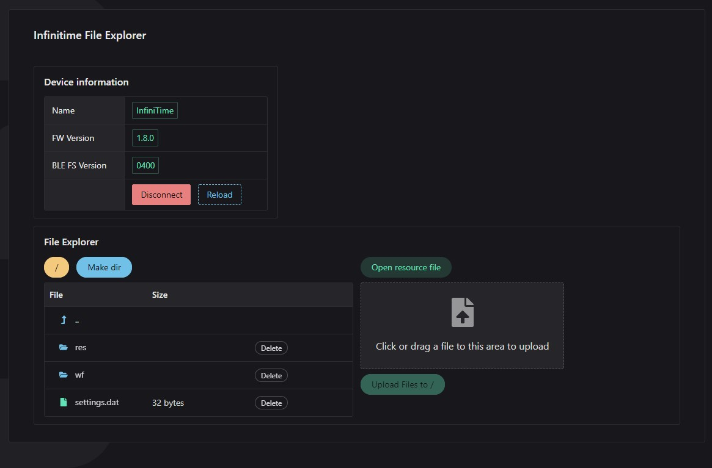
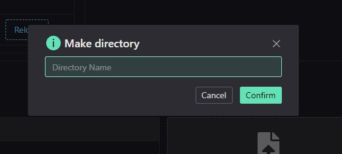
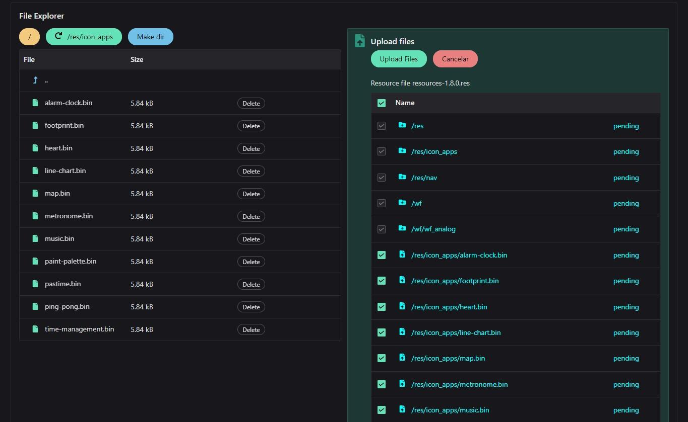
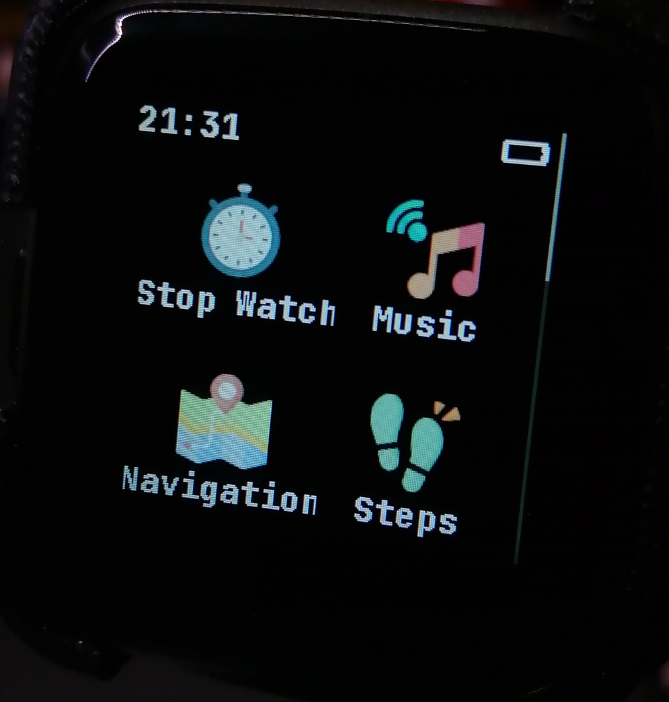

# InfiniTime File Explorer

File Explorer for <a href="https://github.com/InfiniTimeOrg/InfiniTime">InfiniTime version 1.8.0</a> firmware on PineTime smartwatch

View Live https://infinitimeexplorer.netlify.app/

File explorer for InfiniTime external flash, can create and delete directories, delete and upload files.
Also can be used to upload a resource file, the resource file can have directories and files to be uploaded/created on the PineTime.

Tested on Google Chrome, Windows and Android, on the Android some times you need to hit "Reload" to work.






In the resource mode, you can select what files you want to upload.


More info about the resource file soon in my InfiniTime fork

https://github.com/joaquimorg/PinetimeLite/tree/app_list/resources



---

## Project setup
```
npm install
```
### Compiles and hot-reloads for development
```
npm run serve
```
### Compiles and minifies for production
```
npm run build
```